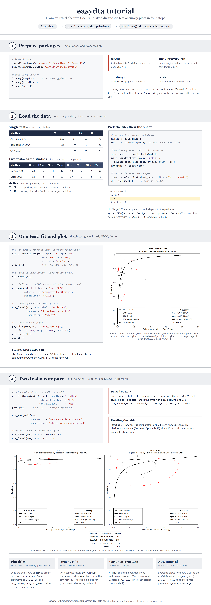
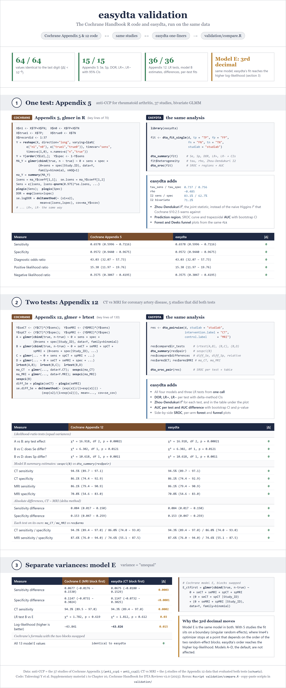

# easydta

**Cochrane-compliant Diagnostic Test Accuracy meta-analysis in R.**

## Contents

| Section | Jump to |
|:---|:---|
| **[1 · What is this package](#1-what-is-this-package)**<br><sub>Cochrane-style DTA meta-analysis in a few calls</sub> | |
| **[2 · How to install it](#2-how-to-install-it)**<br><sub>One line from GitHub, plus an illustrated walk-through</sub> | [Tutorial](#tutorial) |
| **[3 · Data preparation](#3-data-preparation)**<br><sub>Single-test and paired 2×2 layouts</sub> | [Input formats](#input-formats) · [Datasets](#bundled-example-datasets) · [Reshaping](#reshaping-only-needed-when-calling-fit-functions-yourself) |
| **[4 · Single-arm analysis](#4-single-arm-dta-analysis)**<br><sub>One test, many studies</sub> | [Plots](#plots) · [Tidy summaries](#tidy-summaries) |
| **[5 · Pairwise analysis](#5-pairwise-dta-analysis)**<br><sub>Two tests head-to-head, LR tests and differences</sub> | [One call](#one-call-analysis) · [Plots](#plots-1) · [Low-level API](#lower-level-pairwise-api-if-you-dont-want-the-wrapper) |
| **[6 · Small effect analysis](#6-small-effect-analysis)**<br><sub>Deeks funnel and asymmetry test</sub> | |
| **[7 · Validation](#7-validation-against-the-cochrane-handbook)**<br><sub>Cochrane Handbook code vs easydta, same data</sub> | [Results](#results) · [Run it yourself](#run-it-yourself) |

<sub>[References](#references) · [License](#license)</sub>

---

## 1. What is this package

`easydta` is a pedagogical, opinionated R package for diagnostic test
accuracy (DTA) meta-analysis. It implements the bivariate binomial
GLMM workflow recommended by the
[Cochrane Handbook for Systematic Reviews of Diagnostic Test Accuracy
v2.0 (Chapter 10, Supplementary Material 1, Takwoingi et al. 2023)](https://training.cochrane.org/handbook-diagnostic-test-accuracy/current),
exposes it through a small set of `dta_*()` functions, using the methods
Cochrane explicitly endorses (no external diagnostic-meta-analysis
packages required).

**What you get:**

- **One model engine** — a bivariate binomial GLMM via
  `lme4::glmer(cbind(true, n - true) ~ 0 + sens + spec + (0 + sens + spec | studlab))`,
  the same parameterisation as Cochrane Appendix 5.
- **Cochrane-style heterogeneity** — the
  Zhou & Dendukuri (2014) bivariate I² (per-dimension and joint),
  plus τ, ρ, and the prediction-region ellipse — computed automatically
  inside `dta_fit_single()`. Avoids the naive Higgins I² that
  Cochrane §10.2.5 warns against because of the threshold effect.
- **Cochrane Appendix 12 inference** — likelihood-ratio tests for
  test-comparison studies (overall test effect, Sens-differs, Spec-differs)
  and delta-method 95% CIs for absolute and relative Se/Sp differences.
- **Plots out of the box** — coupled sens/spec forest, SROC with
  confidence + prediction regions and trapezoidal AUC (with a parametric
  MVN-bootstrap CI), and a Deeks funnel with contour-enhanced pseudo-CI
  bands and the Deeks asymmetry test.
- **Sensible defaults; few arguments** — every plot function takes
  `test`/`outcome`/`population` for a Cochrane-style title, and every
  composite plot returns a single self-drawing `gtable` (it renders when
  printed — no `grid::grid.draw()` needed).

---

## 2. How to install it

Install directly from GitHub:

```r
# install.packages("remotes")
remotes::install_github("vanioljantunes/easydta")
```

**Required CRAN dependencies** (auto-installed):
`lme4`, `msm`, `lmtest`, `ggplot2`, `grid`, `gridExtra`, `MASS`,
`metafor`, `pracma`.

No extra repositories or non-CRAN packages are needed. AUC is the
trapezoidal integral of the SROC curve; its CI (and the pairwise dAUC
CI + p-value) comes from a built-in parametric MVN bootstrap.

### Tutorial

From an Excel sheet to the plots in four steps: prepare packages, load the
data (`selectFile()`, pick the sheet from `ma`), fit one test with
`dta_fit_single()` → `dta_forest()` / `dta_sroc()` / `dta_funnel()`, then
compare two tests with `dta_pairwise()` → `dta_sroc_pair()`. The same
walk-through is in `?easydta-1-data-preparation`.



The page is built from `tutorial/tutorial.html` (`Rscript tutorial/plot.R`,
then `node tutorial/render.mjs`).

---

## 3. Data preparation

### Input formats

`easydta` accepts two wide layouts depending on the workflow:

**(a) Single-test wide** — one row per study:

| studlab    | TP | FP | FN | TN | (covariates...) |
|------------|----|----|----|----|----------------|
| Smith 2003 | 90 | 10 |  5 | 50 | ...             |

Use this for the single-arm workflow (§4) and also for the pairwise
workflow (§5) when the two arms are encoded as a between-study
covariate (e.g. anti-CCP1 vs anti-CCP2 across different studies).

**(b) Paired wide** — one row per study, `.e` (intervention / index) and
`.c` (control / comparator) suffixes; each study evaluated **both** tests:

| studlab    | TP.e | FP.e | FN.e | TN.e | TP.c | FP.c | FN.c | TN.c |
|------------|------|------|------|------|------|------|------|------|
| Dewey 2006 |  62  |   5  |   4  |  46  |  42  |   2  |   7  |  39  |

Pass this single frame to `dta_pairwise()` (§5). The two arms share a
`studlab`, so the random effect captures the within-study correlation.

### Bundled example datasets

| File / `data()` name | Description |
|----------------------|-------------|
| `data(anti_ccp1)`, `data(anti_ccp2)` (also `inst/extdata/anti_ccp.xlsx`, one sheet per arm: `CCP1`, `CCP2`) | anti-CCP single-arm subsets (Cochrane Handbook ch. 10): 8 CCP1 + 29 CCP2 studies. Columns: `studlab, TP, FP, FN, TN, test`. Each drives the single-arm workflow (§4); `rbind(anti_ccp1, anti_ccp2)` drives the covariate comparison via `dta_compare_tests()`. |
| `data(schuetz)` (also `inst/extdata/schuetz.xlsx`, single sheet `schuetz`) | 5-study CT-vs-MRI dataset for coronary artery disease (Cochrane Appendix 12, direct subset). Wide: `studlab` + `.e` (CT) / `.c` (MRI) counts. Each study did both tests (paired) — drives the wide `dta_pairwise()` workflow (§5). |

### Reshaping (only needed when calling fit functions yourself)

```r
# Single-test wide -> long
long  <- dta_reshape(data,
                     tp = "TP", fp = "FP", fn = "FN", tn = "TN",
                     studlab = "studlab",
                     extra   = "test")   # optional covariate
```

In day-to-day use you can usually skip this step:
`dta_fit_single(wide = TRUE, ...)`, `dta_pairwise(...)`, and
`dta_compare_tests(...)` reshape internally.

---

## 4. Single-arm DTA analysis

**When to use:** one diagnostic test, many studies, no head-to-head
comparison.

```r
library(easydta)
data(anti_ccp2)

fit <- dta_fit_single(anti_ccp2, wide = TRUE,
                      tp = "TP", fp = "FP", fn = "FN", tn = "TN",
                      studlab = "studlab")
print(fit)            # Se, Sp, DOR, LR+, LR- with CIs
                      # plus tau, rho, Zhou-Dendukuri bivariate I^2
```

`fit` is a `dta_single` carrying the raw `glmer` fit, the fixed-effect
VCV, the between-study VCV (`Psi`), the long data, and `$heterogeneity`
(τ_sens, τ_spec, ρ, joint and per-dimension I², the prediction-region
ellipse).

### Plots

```r
# Coupled sens / spec forest -- single composite (5 aligned panels)
dta_forest(fit)

# SROC + 95% confidence region + 95% prediction region + AUC
dta_sroc(fit, test.label = "anti-CCP2",
         outcome    = "rheumatoid arthritis",
         population = "adults")
```

The vignette: [`examples/example_single.Rmd`](examples/example_single.Rmd).

### Tidy summaries

```r
dta_summary(fit)      # Se, Sp, DOR, LR+, LR- with 95% CIs
dta_derived(fit)      # DOR / LR+ / LR- with delta-method CIs
```

---

## 5. Pairwise DTA analysis

**When to use:** two tests evaluated head-to-head. For a **paired** design
(each study did both tests) pass the wide `.e`/`.c` frame to
`dta_pairwise()`. For a **between-study covariate** design (each study did
one test, e.g. `anti_ccp`) use `dta_compare_tests()`.

### One-call analysis

```r
library(easydta)

# Paired wide frame: one row per study, .e = CT (index), .c = MRI
data(schuetz)
res <- dta_pairwise(schuetz,
                    studlab            = "studlab",
                    intervention.label = "CT",   # the .e arm
                    control.label      = "MRI")  # the .c arm
print(res)
# Prints:
#   - per-arm Se / Sp / DOR / LR+/- summary
#   - LR tests A vs B (overall), C vs B (Sens differs?),
#                D vs B (Spec differs?)
#   - Absolute & relative Se/Sp differences with delta-method 95% CIs

# Variance structure (Cochrane Appendix 12): "equal" = model B (default),
# "unequal" = model E (separate between-study variances per test):
res_E <- dta_pairwise(schuetz, studlab = "studlab",
                      intervention.label = "CT", control.label = "MRI",
                      variance = "unequal")
```

For a single frame carrying the test column as a between-study covariate
(e.g. `anti_ccp`), use the sister entry point:

```r
data(anti_ccp1); data(anti_ccp2)
res_cov <- dta_compare_tests(rbind(anti_ccp1, anti_ccp2), test_var = "test")
```

`res` is a `dta_pairwise_result` with `$pair`, `$compare`, and
`$arms` (a named list of per-arm `dta_single` fits), plus `$labels`
mapping the `intervention` / `control` roles to the two arm names.

### Plots

```r
# Per-arm forest -- pick the arm by role (intervention / control); the arm
# name is looked up from the result. Bare word or string both work.
dta_forest(res, test = intervention)
dta_forest(res, test = control)

# Side-by-side SROC + Cochrane-style differences table beneath.
# Arms default to the intervention / control roles, so no need to name them.
dta_sroc_pair(res,
              outcome    = "coronary artery disease",
              population = "adults with suspected CAD",
              auc_ic = TRUE)   # FALSE skips the AUC bootstrap (faster)
```

The differences table reports per-arm Sens, Spec and AUC (each with
95% CI), the absolute difference `.e - .c` (95% CI), and a p-value:

| Measure | CT | MRI | Diff (CT - MRI) | P-value |
|---|---|---|---|---|
| Sensitivity | 0.945 (0.897, 0.971) | 0.861 (0.794, 0.909) | 0.084 (0.017, 0.150) | 0.012 |
| Specificity | 0.861 (0.744, 0.929) | 0.708 (0.546, 0.830) | 0.153 (0.047, 0.259) | 0.001 |

*(AUC row appears when `auc_ic = TRUE`.)*

- Sens / Spec p-values are LR tests (Cochrane Appendix 12, rows 2-3 of
  `res$compare$lr_tests`).
- Sens / Spec diff CIs are delta-method on the joint pairwise model.
- AUC + dAUC + p-value come from the parametric MVN bootstrap: per-arm AUC
  draws (trapezoidal integral of each resampled SROC) are differenced to
  give the dAUC CI and a two-sided p-value. Arms are drawn independently,
  so the dAUC CI is mildly conservative. The per-panel AUC boxes reuse the
  same numbers.

The vignette: [`examples/example_pairwise.Rmd`](examples/example_pairwise.Rmd).

### Lower-level pairwise API (if you don't want the wrapper)

```r
long  <- dta_reshape_pairwise(schuetz, studlab = "studlab",
                              intervention = "CT", control = "MRI")  # low-level: still positional labels
pair  <- dta_fit_pairwise(long, test_var = "test")  # models A/B/C/D
cmp   <- dta_compare(pair)                          # LR tests + diffs
```

---

## 6. Small effect analysis

Cochrane-recommended publication-bias diagnostic for DTA reviews
(Handbook v2.0 §10.6.4; Deeks, Macaskill & Irwig 2005).

```r
# Single-arm
dta_funnel(fit,
           test.label = "anti-CCP2",
           outcome    = "rheumatoid arthritis",
           population = "adults")

# Per arm of a pairwise comparison -- pick by role (test.label defaults
# to the selected arm's name).
dta_funnel(res, test = intervention,
           outcome    = "coronary artery disease",
           population = "adults with suspected CAD")
```

The plot puts `ln(DOR)` on the x-axis and `1/sqrt(ESS)` on the y-axis
(reversed — large studies on top), with a dashed vertical reference
line at the REML-pooled `ln(DOR)` and three nested pseudo-confidence
triangles (90 / 95 / 99 %, darker toward the centre) so you can read
asymmetry by eye.

Underneath the funnel, horizontally aligned with the reference line, a
small grid table reports:

| Statistic | Value |
|---|---|
| Number of studies | 29 |
| Deeks p-value | 0.246 |

The Deeks p-value comes from a weighted linear regression of
`ln(DOR_i)` on `1/sqrt(ESS_i)` with weights `ESS_i` — slope ≠ 0
indicates funnel asymmetry consistent with publication bias. The full
pooled DOR (REML, 95% CI), regression slope (SE), t and df are
attached for programmatic use:

```r
g <- dta_funnel(fit, ...)
attr(g, "deeks")        # full Deeks regression list
attr(g, "pooled")       # pooled DOR + 95% CI on log and natural scales
attr(g, "study_data")   # per-study TP/FP/FN/TN, lnDOR, SE, ESS
```

`continuity = 0.5` (default) is added to all four cells of any study
with a zero cell — matches `metafor::escalc(to = "only0")`.

---

## 7. Validation against the Cochrane Handbook

easydta implements the R code published with the Cochrane Handbook for
Systematic Reviews of Diagnostic Test Accuracy v2.0 (Supplementary material 1
to Chapter 10, Takwoingi et al. 2023). To show the numbers are the same, the
Cochrane code and the easydta code are run on the same studies:

- **Appendix 5** (one test): anti-CCP for rheumatoid arthritis, all 37 studies
  (`rbind(anti_ccp1, anti_ccp2)`).
- **Appendix 12** (two tests): CT vs MRI for coronary artery disease, the 5
  studies that evaluated both tests (`schuetz`). The published appendix reads
  a 108-record `schuetz.csv`; the code is the same, only the data are the
  paired subset bundled with easydta.



### Results

64 of 64 values agree to the last digit (|difference| < 1e-6):

| Analysis | Compared | Cochrane | easydta |
|---|---|---|---|
| App. 5, anti-CCP | Sensitivity | 0.658 (0.600, 0.712) | 0.658 (0.600, 0.712) |
| | Specificity | 0.957 (0.944, 0.967) | 0.957 (0.944, 0.967) |
| | DOR | 43.03 (32.07, 57.73) | 43.03 (32.07, 57.73) |
| | LR+ / LR- | 15.38 (11.97, 19.76) / 0.358 (0.305, 0.419) | 15.38 (11.97, 19.76) / 0.358 (0.305, 0.419) |
| App. 12, CT vs MRI | LR test A vs B | χ² 16.918, p 0.00021 | χ² 16.918, p 0.00021 |
| | LR test B vs C (Se differs?) | χ² 6.302, p 0.0121 | χ² 6.302, p 0.0121 |
| | LR test B vs D (Sp differs?) | χ² 10.618, p 0.0011 | χ² 10.618, p 0.0011 |
| | CT Se / Sp, model B | 94.5% / 86.1% | 94.5% / 86.1% |
| | MRI Se / Sp, model B | 86.1% / 70.8% | 86.1% / 70.8% |
| | Se difference CT − MRI | 0.084 (0.017, 0.150) | 0.084 (0.017, 0.150) |
| | Sp difference CT − MRI | 0.153 (0.047, 0.259) | 0.153 (0.047, 0.259) |
| | CT alone / MRI alone Se | 94.3% / 87.6% | 94.3% / 87.6% |

On top of what the appendices report, easydta gives the between-study SDs and
correlation, the Zhou-Dendukuri bivariate I² (anti-CCP: 83.1% for Se, 62.7%
for Sp, 71.2% joint), the prediction region, SROC curves with AUC and a
bootstrap CI for the AUC difference, and forest and funnel plots.

**Model E (`variance = "unequal"`).** Cochrane's model E and easydta's agree to
the 3rd decimal (Se difference 0.0677 vs 0.0675). Both fit the same model; on
5 studies the fit sits on a boundary and lme4 stops at a point that depends on
the order of the two random-effect blocks. easydta lists the CT block first
and reaches the higher log-likelihood (−43.826 vs −43.841). Cochrane's formula
with the blocks swapped gives easydta's numbers exactly (last block of
`validation/cochrane_appendix12.R`).

### Run it yourself

Paste each script into a fresh R session, or run everything at once from the
package root with `Rscript validation/compare.R`, which prints every value
side by side (about 40 seconds). The scripts need `lme4`, `msm`, `lmtest` and
easydta; no data files. Each script runs in a few seconds.

<details>
<summary><b>Cochrane Appendix 5</b>: <code>validation/cochrane_appendix5.R</code></summary>

```r
# Cochrane Handbook for Systematic Reviews of Diagnostic Test Accuracy v2.0
# Supplementary material 1 to Chapter 10 (Takwoingi et al. 2023)
# Appendix 5: Meta-analysis of a single index test using glmer in R to fit a
# bivariate model.
#
# The code below is the published code. Lines that differ from the PDF are
# marked "# CHANGED:". Paste the whole file into R; no files are needed.
# install.packages(c("lme4", "msm"))

################## 1. DATA IMPORT ###################################
# CHANGED: the published code runs setwd("U:/Handbook 2020") and
# (X=read.csv("anti-ccp.csv")). The same 37 anti-CCP studies are typed in here.
X = data.frame(
  Study.ID = c("Bas 2003", "Bizzaro 2001", "Goldbach-Mansky 2000", "Jansen 2003",
               "Saraux 2003", "Schellekens 2000", "Vincent 2002", "Zeng 2003",
               "Aotsuka 2005", "Bombardieri 2004", "Choi 2005", "Correa 2004",
               "De Rycke 2004", "Dubucquoi 2004", "Fernandez-Suarez 2005",
               "Garcia-Berrocal 2005", "Girelli 2004", "Greiner 2005",
               "Grootenboer-Mignot 2004", "Hitchon 2004", "Kamali 2005",
               "Kumagai 2004", "Kwok 2005", "Lee 2003", "Lopez-Hoyos 2004",
               "Nell 2005", "Nielen 2005", "Quinn 2006", "Rantapaa-Dahlqvist 2003",
               "Raza 2005", "Sauerland 2005", "Soderlin 2004", "Suzuki 2003",
               "Vallbracht 2004", "van Gaalen 2005", "van Venrooij 2004",
               "Vittecoq 2004"),
  TP = c(110, 40, 43, 110, 40, 72, 139, 90, 115, 23, 236, 74, 89, 90, 31, 69, 25,
         70, 167, 26, 26, 64, 71, 68, 38, 42, 149, 147, 47, 24, 171, 7, 481, 190,
         82, 865, 69),
  FP = c(24, 5, 1, 3, 11, 14, 7, 7, 17, 0, 20, 11, 4, 2, 0, 8, 2, 5, 8, 8, 1, 14,
         2, 14, 3, 2, 7, 10, 7, 3, 26, 2, 23, 12, 13, 79, 5),
  FN = c(86, 58, 63, 148, 46, 77, 101, 101, 16, 7, 88, 8, 29, 50, 22, 18, 10, 17,
         98, 15, 20, 15, 58, 35, 0, 60, 109, 35, 20, 18, 60, 9, 68, 105, 71, 252,
         107),
  TN = c(215, 227, 120, 118, 146, 298, 464, 313, 73, 39, 231, 130, 142, 129, 75,
         38, 40, 228, 88, 15, 56, 293, 66, 132, 73, 96, 114, 106, 375, 79, 443,
         51, 185, 408, 301, 2218, 133)
)

############## 2. META-ANALYSIS OF DTA - USING GLMER ###################
### Install lme4 package if required (to run remove the # and select an
### appropriate CRAN mirror).
# install.packages("lme4")
### Load the package lme4.
library(lme4)
### In order to specify the generalized linear model, first, we need to set
### up the data.
### Generate 5 new variables of type long. We need these before we can
### reshape the data.
# n1 is number diseased
# n0 is number without disease
# true1 is number of true positives
# true0 is the number of true negatives
# recordid is the unique identifier for each observation in the dataset
X$n1 <- X$TP+X$FN
X$n0 <- X$FP+X$TN
X$true1 <- X$TP
X$true0 <- X$TN
X$recordid <- 1:37
### Reshape the data from wide to long format ###
Y = reshape(X, direction="long", varying=list(c("n1", "n0"), c("true1",
  "true0")), timevar="sens", times=c(1,0), v.names=c("n","true"))
### Sort data by study to cluster the 2 records per study together. ###
Y = Y[order(Y$id),]
Y$spec<- 1-Y$sens
#############################
### Perform meta-analysis ###
#############################
## Now, let's examine the model specification and output in more detail.
# The variable true specifies the response while sens and spec are dummy
# variables.
# The fixed effect for logit sensitivity and logit specificity are the
# coefficients of sens and spec.
# The constant term is supressed by adding (0 + ...) to the model formula.
# Adding (0 + sens + spec | study) to the model includes study-level random
# effects.
# family = binomial specifies the data are in binomial form.
# Specified in the form above, the between study covariance matrix is
# unstructured.
# nAGQ controls number of points per axis for evaluating the adaptive
# Gauss-Hermite approximation to the log-likelihood. Defaults to 1,
# corresponding to the Laplace approximation.
# CHANGED: verbose=2 removed (it only prints the optimizer trace).
(MA_Y = glmer(formula=cbind(true, n - true) ~ 0 + sens + spec + (0+sens +
  spec|Study.ID), data=Y, family=binomial, nAGQ=1))
### More detail can be obtained by using the summary command.
(ma_Y = summary(MA_Y))
### To obtain the between study covariance between logit sensitivity and
### specificity for each test use
(summary(MA_Y))$vcov
### For the full list of outputs
labels( ma_Y)
### Therefore, to extract the coefficients
ma_Y$coeff
(lsens = ma_Y$coeff[1,1])
(lspec = ma_Y$coeff[2,1])
se.lsens = ma_Y$coeff[1,2]
se.lspec = ma_Y$coeff[2,2]
### Then we can manually create 95% confidence intervals for logit sens and
### spec
Sens = c(lsens, lsens-qnorm(0.975)*se.lsens, lsens+qnorm(0.975)*se.lsens)
Spec = c(lspec, lspec-qnorm(0.975)*se.lspec, lspec+qnorm(0.975)*se.lspec)
### Or as a dataframe
logit_sesp = data.frame(estimate = c(lsens, lspec),
      lci = c(lsens-qnorm(0.975)*se.lsens, lspec-qnorm(0.975)*se.lspec),
      uci = c(lsens+qnorm(0.975)*se.lsens, lspec+qnorm(0.975)*se.lspec),
      row.names = c("lSens", "lSpec"))
### R has a built in logit and inv.logit function (use qlogis and plogis).
plogis(Sens)
plogis(Spec)
### Obtaining diagnostic odds rato (DOR), positive likelihood ratio (LRp)
### and negative likelihood ratio (LRn)
(DOR = exp(lsens+lspec))
(LRp = plogis(lsens)/(1-plogis(lspec)))
(LRn = ((1-plogis(lsens))/plogis(lspec)))
### Standard errors and confidence intervals of DOR and LRs can be
### calculated using delta method. This requires the package msm.
# install.packages("msm")
library(msm)
se.logDOR = deltamethod (~ (x1+x2), mean=c(lsens,lspec), cov=ma_Y$vcov)
se.logLRp = deltamethod (~ log((exp(x1)/(1+exp(x1)))/(1-
  (exp(x2)/(1+exp(x2))))), mean=c(lsens,lspec), cov=ma_Y$vcov)
se.logLRn = deltamethod (~ log((1-
  (exp(x1)/(1+exp(x1))))/(exp(x2)/(1+exp(x2)))), mean=c(lsens,lspec),
  cov=ma_Y$vcov)
data.frame(estimate = c(DOR, LRp, LRn),
      lci = c(exp(log(DOR)-qnorm(0.975)*se.logDOR), exp(log(LRp)-
        qnorm(0.975)*se.logLRp), exp(log(LRn)-qnorm(0.975)*se.logLRn)),
      uci = c(exp(log(DOR)+qnorm(0.975)*se.logDOR), exp(log(LRp)+
        qnorm(0.975)*se.logLRp), exp(log(LRn)+qnorm(0.975)*se.logLRn)),
      row.names = c("DOR", "LR+", "LR-"))
```

</details>

<details>
<summary><b>easydta, same analysis</b>: <code>validation/easydta_appendix5.R</code></summary>

```r
# easydta: the Cochrane Appendix 5 analysis (single test, bivariate GLMM)
# on the same 37 anti-CCP studies. Paste the whole file into R.
# install.packages("remotes"); remotes::install_github("vanioljantunes/easydta")

library(easydta)

# Same data as cochrane_appendix5.R (also: rbind(anti_ccp1, anti_ccp2))
d <- data.frame(
  studlab = c("Bas 2003", "Bizzaro 2001", "Goldbach-Mansky 2000", "Jansen 2003",
              "Saraux 2003", "Schellekens 2000", "Vincent 2002", "Zeng 2003",
              "Aotsuka 2005", "Bombardieri 2004", "Choi 2005", "Correa 2004",
              "De Rycke 2004", "Dubucquoi 2004", "Fernandez-Suarez 2005",
              "Garcia-Berrocal 2005", "Girelli 2004", "Greiner 2005",
              "Grootenboer-Mignot 2004", "Hitchon 2004", "Kamali 2005",
              "Kumagai 2004", "Kwok 2005", "Lee 2003", "Lopez-Hoyos 2004",
              "Nell 2005", "Nielen 2005", "Quinn 2006", "Rantapaa-Dahlqvist 2003",
              "Raza 2005", "Sauerland 2005", "Soderlin 2004", "Suzuki 2003",
              "Vallbracht 2004", "van Gaalen 2005", "van Venrooij 2004",
              "Vittecoq 2004"),
  TP = c(110, 40, 43, 110, 40, 72, 139, 90, 115, 23, 236, 74, 89, 90, 31, 69, 25,
         70, 167, 26, 26, 64, 71, 68, 38, 42, 149, 147, 47, 24, 171, 7, 481, 190,
         82, 865, 69),
  FP = c(24, 5, 1, 3, 11, 14, 7, 7, 17, 0, 20, 11, 4, 2, 0, 8, 2, 5, 8, 8, 1, 14,
         2, 14, 3, 2, 7, 10, 7, 3, 26, 2, 23, 12, 13, 79, 5),
  FN = c(86, 58, 63, 148, 46, 77, 101, 101, 16, 7, 88, 8, 29, 50, 22, 18, 10, 17,
         98, 15, 20, 15, 58, 35, 0, 60, 109, 35, 20, 18, 60, 9, 68, 105, 71, 252,
         107),
  TN = c(215, 227, 120, 118, 146, 298, 464, 313, 73, 39, 231, 130, 142, 129, 75,
         38, 40, 228, 88, 15, 56, 293, 66, 132, 73, 96, 114, 106, 375, 79, 443,
         51, 185, 408, 301, 2218, 133)
)

# Same model: glmer(cbind(true, n - true) ~ 0 + sens + spec +
#                   (0 + sens + spec | studlab), family = binomial, nAGQ = 1)
fit <- dta_fit_single(d, tp = "TP", fp = "FP", fn = "FN", tn = "TN",
                      studlab = "studlab")
print(fit)

# Cochrane: plogis(Sens), plogis(Spec) and the DOR / LR+ / LR- data frame
dta_summary(fit)

# easydta adds: between-study SDs, correlation, Zhou-Dendukuri I^2
fit$heterogeneity[c("tau_sens", "tau_spec", "rho",
                    "I2_sens", "I2_spec", "I2_biv")]

# easydta adds: SROC with confidence and prediction regions, AUC
dta_sroc(fit, test.label = "anti-CCP", outcome = "rheumatoid arthritis",
         population = "adults", legend.pos = "bottomleft")
```

</details>

<details>
<summary><b>Cochrane Appendix 12</b>: <code>validation/cochrane_appendix12.R</code></summary>

```r
# Cochrane Handbook for Systematic Reviews of Diagnostic Test Accuracy v2.0
# Supplementary material 1 to Chapter 10 (Takwoingi et al. 2023)
# Appendix 12: Bivariate meta-regression using glmer in R, comparison of CT
# and MRI for coronary artery disease.
#
# The code below is the published code. Lines that differ from the PDF are
# marked "# CHANGED:"; blocks appended at the end are marked "# ADDED:".
# Paste the whole file into R; no files are needed.
# install.packages(c("lme4", "lmtest", "msm"))

#################### 1. DATA IMPORT ############################
# CHANGED: the published code runs setwd("U:/Handbook 2020") and
# (X=read.csv("schuetz.csv")), 108 records. Here: the 5 studies that evaluated
# both CT and MRI (easydta's `schuetz`), one row per study and test.
X = data.frame(
  Study_ID = rep(c("Dewey 2006", "Kefer 2005", "Langer 2009", "Maintz 2007",
                   "Pouleur 2008"), 2),
  Test = rep(c("CT", "MRI"), each = 5),
  TP = c(62, 32, 25, 15, 16,   42, 30, 18, 15, 17),
  FP = c( 5,  6,  2,  2,  7,    2,  9, 15,  1, 17),
  FN = c( 4,  2,  1,  1,  1,    7,  4,  8,  1,  0),
  TN = c(46, 12, 40,  2, 53,   39,  9, 27,  3, 43)
)
################## 2. PREPARE THE DATASETS #####################
### Install lme4 package if required (to run remove the # and select an
### appropriate CRAN mirror).
# install.packages("lme4")
### Load the package lme4.
library(lme4)
### In order to specify the generalized linear model, first, we need to set
### up the data.
### Generate 5 new variables of type long. We need these before we can
### reshape the data.
# n1 is number diseased
# n0 is number without disease
# true1 is number of true positives
# true0 is the number of true negatives
# recordid is the unique identifier for each observation in the dataset
X$n1 <- X$TP+X$FN
X$n0 <- X$FP+X$TN
X$true1 <- X$TP
X$true0 <- X$TN
X$recordid <- 1:10   # CHANGED: 1:108 in the published code (108 records)
### Reshape the data from wide to long format. ###
Y = reshape(X, direction="long", varying=list(c("n1", "n0"),
  c("true1","true0")), timevar="sens", times=c(1,0), v.names=
  c("n","true"))
### Sort data by study to cluster the 2 records per study together. ###
Y = Y[order(Y$id),]
Y$spec<- 1-Y$sens
### Generate a seperate data frame for each test type.
Y.CT = Y[Y$Test=="CT",]
Y.MRI = Y[Y$Test=="MRI",]
########### 3. META-REGRESSION - USING GLMER WITH A COVARIATE ###########
### Meta-analysis of CT ###
(ma_CT = glmer(formula=cbind(true, n - true ) ~ 0 + sens + spec + (0+sens +
  spec|Study_ID), data=Y.CT, family=binomial))
### More detail about the parameter estimates can be obtained by using the
### summary command.
summary(ma_CT)
### Meta-analysis of MRI ###
(ma_MRI = glmer(formula=cbind(true, n - true ) ~ 0 + sens + spec + (0+sens
  + spec|Study_ID), data=Y.MRI, family=binomial))
### More detail about the parameter estimates can be obtained by using the
### summary command.
summary(ma_MRI)

### Fit the model without the covariate. ###
(A = glmer(formula=cbind(true, n - true ) ~ 0 + sens + spec + (0+sens +
  spec|Study_ID), data=Y, family=binomial))
### Add covariate terms to the model for both logit sensitivity and logit
### specificity. This model assumes equal variances for both tests.
Y$CT <- as.numeric((Y$Test == "CT"))
Y$MRI <- as.numeric((Y$Test == "MRI"))
Y$seCT <- (Y$CT)*(Y$sens)
Y$seMRI <- (Y$MRI)*(Y$sens)
Y$spCT <- (Y$CT)*(Y$spec)
Y$spMRI <- (Y$MRI)*(Y$spec)
(B = glmer(formula=cbind(true, n - true) ~ 0 + seCT + seMRI + spCT + spMRI
  + (0+sens + spec|Study_ID), data=Y, family=binomial))
### The models can be formally compared using a LR test.
### Install lmtest package if required (to run remove the #).
# install.packages("lmtest")
### Load the package lmtest.
library(lmtest)
lrtest(A,B)
### Is there a statistically significant difference in sensitivity between
### CT and MRI?
(C = glmer(formula=cbind(true, n - true) ~ 0 + sens + spCT + spMRI +
  (0+sens + spec|Study_ID), data=Y, family=binomial))
lrtest(B,C)
### Is there a statistically significant difference in specificity between
### CT and MRI?
(D = glmer(formula=cbind(true, n - true) ~ 0 + seCT + seMRI + spec +
  (0+sens + spec|Study_ID), data=Y, family=binomial))
lrtest(B,D)
### Different variances for each test
(E = glmer(formula=cbind(true, n - true ) ~ 0 + seCT + seMRI + spCT + spMRI
  +(0 +seMRI + spMRI |Study_ID) +(0 +seCT + spCT |Study_ID), data=Y,
  family=binomial))
### More detail can be obtained by using the summary command.
summary(E)
lrtest(B,E)
lrtest(A,E)
### More detail about the parameter estimates can be obtained by using the
### summary command.
summary(E)
### To obtain the between study covariance between logit sensitivity and
### specificity for each test use
(vcovE = (summary(E))$vcov)
### The overall logit-sensitivity and -specificity are given in
cB = summary(B)$coefficients
cE = summary(E)$coefficients
### Therefore confidence intervals can be extracted with the following
### function
sespci <-function(X) {
  cX = summary(X)$coefficients
  rows = nrow(cX)
  rnames = rownames(summary(X)$coefficients)
  lsesp = matrix(data=NA, nrow=rows, ncol=3)
  for(i in 1:rows) {
    lsesp[i,1] = cX[i,1]
    lsesp[i,2] = cX[i,1] - qnorm(0.975)*cX[i,2]
    lsesp[i,3] = cX[i,1] + qnorm(0.975)*cX[i,2]
  }
  rnames
  sesp = round(100 * plogis(lsesp), digits=1)
  row.names(sesp) <- c(rnames)
  sesp
}
sespci(ma_CT)
sespci(ma_MRI)
sespci(A)
sespci(B)
sespci(C)
sespci(D)
sespci(E)

### Standard errors and confidence intervals for absolute and relative
### differences can be calculated using the delta method.
# This requires the package msm.
# install.packages("msm")
### Load the package msm.
library(msm)
seCT = cE[1,1]
seMRI = cE[2,1]
spCT = cE[3,1]
spMRI = cE[4,1]
se_cov = vcovE[1:2,1:2]
sp_cov = vcovE[3:4,3:4]

### Absolute difference
diff_Se=(exp(seCT)/(1+exp(seCT)))-(exp(seMRI)/(1+exp(seMRI)))
diff_Sp=(exp(spCT)/(1+exp(spCT)))-(exp(spMRI)/(1+exp(spMRI)))
se.diff_Se=deltamethod (~ (exp(x1)/(1+exp(x1)))-(exp(x2)/(1+exp(x2))),
  mean=c(seCT,seMRI), cov=se_cov)
se.diff_Sp=deltamethod (~ (exp(x1)/(1+exp(x1)))-(exp(x2)/(1+exp(x2))),
  mean=c(spCT,spMRI), cov=sp_cov)
data.frame(estimate=c(diff_Se, diff_Sp),
            lci=c(diff_Se-qnorm(0.975)*se.diff_Se, diff_Sp-
              qnorm(0.975)*se.diff_Sp),
            uci=c(diff_Se+qnorm(0.975)*se.diff_Se, diff_Sp+
              qnorm(0.975)*se.diff_Sp),
            row.names=c("Absolute difference Sens", "Absolute difference Spec"))

### Relative difference
rel_Se = (exp(seCT)/(1+exp(seCT)))/(exp(seMRI)/(1+exp(seMRI)))
rel_Sp = (exp(spCT)/(1+exp(spCT)))/(exp(spMRI)/(1+exp(spMRI)))
se.rel_Se = deltamethod (~ log((exp(x1)/(1+exp(x1)))/
  (exp(x2)/(1+exp(x2)))), mean=c(seCT,seMRI), cov=se_cov)
se.rel_Sp = deltamethod (~ log((exp(x1)/(1+exp(x1)))/
  (exp(x2)/(1+exp(x2)))), mean=c(spCT,spMRI), cov=sp_cov)
data.frame(estimate=c(rel_Se, rel_Sp),
            lci=c(exp(log(rel_Se)-qnorm(0.975)*se.rel_Se), exp(
              log(rel_Sp)-qnorm(0.975)*se.rel_Sp)),
            uci=c(exp(log(rel_Se)+qnorm(0.975)*se.rel_Se),
              exp(log(rel_Sp)+qnorm(0.975)*se.rel_Sp)),
            row.names=c("Relative difference Sens", "Relative difference Spec"))

# ADDED: the same absolute differences from model B (equal variances), which
# is what easydta reports by default. Same formulas, B instead of E.
vcovB = (summary(B))$vcov
diff_Se_B = plogis(cB[1,1]) - plogis(cB[2,1])
diff_Sp_B = plogis(cB[3,1]) - plogis(cB[4,1])
se.diff_Se_B = deltamethod (~ (exp(x1)/(1+exp(x1)))-(exp(x2)/(1+exp(x2))),
  mean=c(cB[1,1],cB[2,1]), cov=vcovB[1:2,1:2])
se.diff_Sp_B = deltamethod (~ (exp(x1)/(1+exp(x1)))-(exp(x2)/(1+exp(x2))),
  mean=c(cB[3,1],cB[4,1]), cov=vcovB[3:4,3:4])
data.frame(estimate=c(diff_Se_B, diff_Sp_B),
           lci=c(diff_Se_B-qnorm(0.975)*se.diff_Se_B, diff_Sp_B-qnorm(0.975)*se.diff_Sp_B),
           uci=c(diff_Se_B+qnorm(0.975)*se.diff_Se_B, diff_Sp_B+qnorm(0.975)*se.diff_Sp_B),
           row.names=c("Absolute difference Sens (model B)", "Absolute difference Spec (model B)"))

# ADDED: model E with the two random-effect blocks in the other order (CT
# block first, as easydta writes it). Same model; on these 5 studies the fit
# sits on a boundary and this order reaches a slightly higher log-likelihood.
(E_ctfirst = glmer(formula=cbind(true, n - true ) ~ 0 + seCT + seMRI + spCT + spMRI
  +(0 +seCT + spCT |Study_ID) +(0 +seMRI + spMRI |Study_ID), data=Y,
  family=binomial))
c(logLik_E = as.numeric(logLik(E)), logLik_E_ctfirst = as.numeric(logLik(E_ctfirst)))
sespci(E_ctfirst)
```

</details>

<details>
<summary><b>easydta, same analysis</b>: <code>validation/easydta_appendix12.R</code></summary>

```r
# easydta: the Cochrane Appendix 12 analysis (CT vs MRI, bivariate
# meta-regression with likelihood-ratio tests) on the same 5 paired studies.
# Paste the whole file into R.
# install.packages("remotes"); remotes::install_github("vanioljantunes/easydta")

library(easydta)

# Same data as cochrane_appendix12.R, one row per study (also: data(schuetz)).
# .e = CT (index), .c = MRI (comparator)
d <- data.frame(
  studlab = c("Dewey 2006", "Kefer 2005", "Langer 2009", "Maintz 2007",
              "Pouleur 2008"),
  TP.e = c(62, 32, 25, 15, 16), FP.e = c(5, 6, 2, 2, 7),
  FN.e = c(4, 2, 1, 1, 1),      TN.e = c(46, 12, 40, 2, 53),
  TP.c = c(42, 30, 18, 15, 17), FP.c = c(2, 9, 15, 1, 17),
  FN.c = c(7, 4, 8, 1, 0),      TN.c = c(39, 9, 27, 3, 43)
)

# Equal variances: Cochrane models A, B, C, D in one call
res <- dta_pairwise(d, studlab = "studlab",
                    intervention.label = "CT", control.label = "MRI")

res$compare$lr_tests     # Cochrane: lrtest(A,B), lrtest(B,C), lrtest(B,D)
dta_summary(res$pair)    # Cochrane: sespci(B), plus DOR / LR+ / LR- per test
res$compare$differences  # Cochrane: absolute and relative differences, model B
res$arms$CT              # Cochrane: ma_CT  (+ Zhou-Dendukuri I^2)
res$arms$MRI             # Cochrane: ma_MRI (+ Zhou-Dendukuri I^2)

# Unequal variances: Cochrane model E
resE <- dta_pairwise(d, studlab = "studlab",
                     intervention.label = "CT", control.label = "MRI",
                     variance = "unequal")
dta_summary(resE$pair)    # Cochrane: sespci(E)
resE$compare$differences  # Cochrane: absolute and relative differences, model E

# Cochrane: lrtest(B,E), do the tests need separate variances?
lmtest::lrtest(res$pair$models$B, resE$pair$models$B)

# easydta adds: side-by-side SROC with AUC and the differences table
dta_sroc_pair(res, outcome = "coronary artery disease",
              population = "adults with suspected CAD",
              legend.pos = "bottomleft")
```

</details>

The validation page is built from `tutorial/validation.html`
(`node tutorial/render.mjs validation`).

---

## References

- Takwoingi Y *et al.* *Supplementary material 1 to Chapter 10: Code
  for undertaking meta-analysis.* Cochrane Handbook for Systematic
  Reviews of Diagnostic Test Accuracy v2.0 (July 2023).
- Zhou Y, Dendukuri N. *Statistics for quantifying heterogeneity in
  univariate and bivariate meta-analyses of binary data: the case of
  meta-analyses of diagnostic accuracy.* Stat Med. 2014;33(16):2701-2717.
- Deeks JJ, Macaskill P, Irwig L. *The performance of tests of
  publication bias and other sample size effects in systematic reviews
  of diagnostic test accuracy was assessed.* J Clin Epidemiol.
  2005;58(9):882-893.
- Noma H, Matsushima Y. *Confidence interval for the AUC of SROC curve
  and some related methods using bootstrap for meta-analysis of
  diagnostic accuracy studies.* arXiv:2004.04339 (2020).

## License

MIT.
